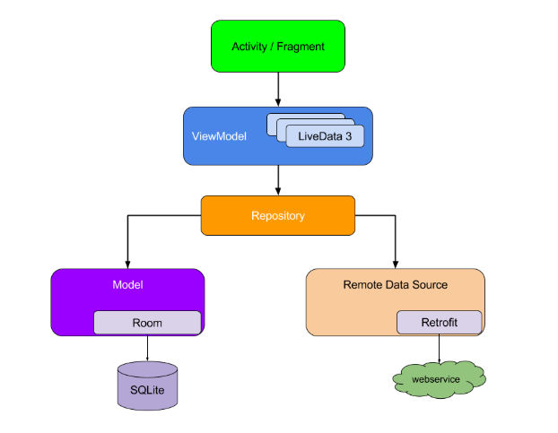
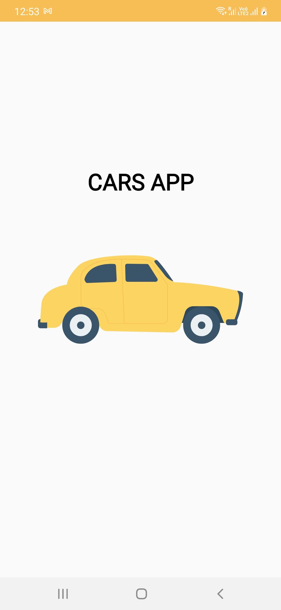
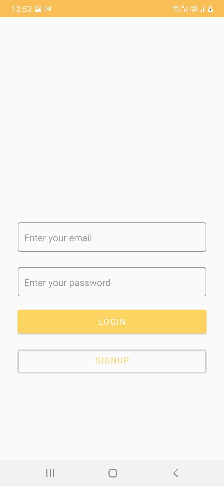
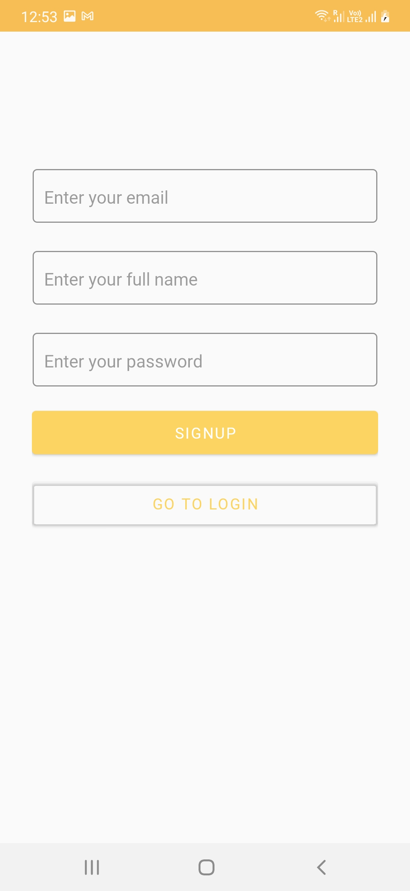
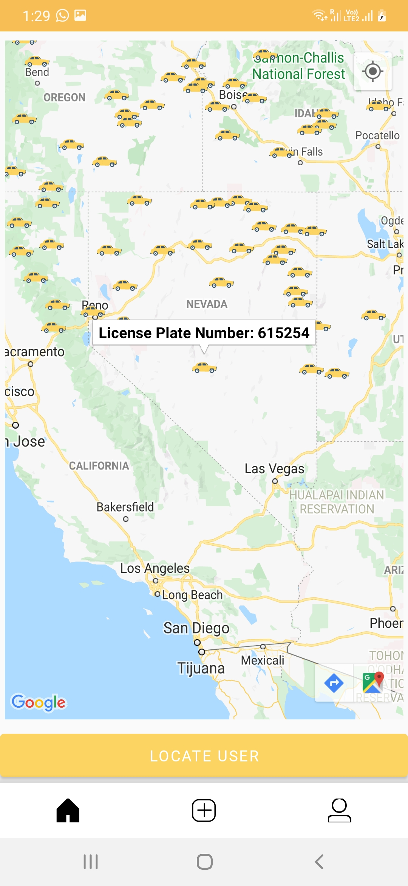
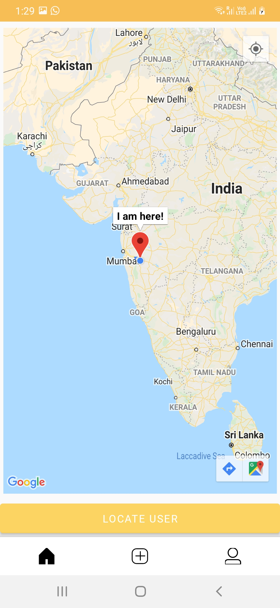
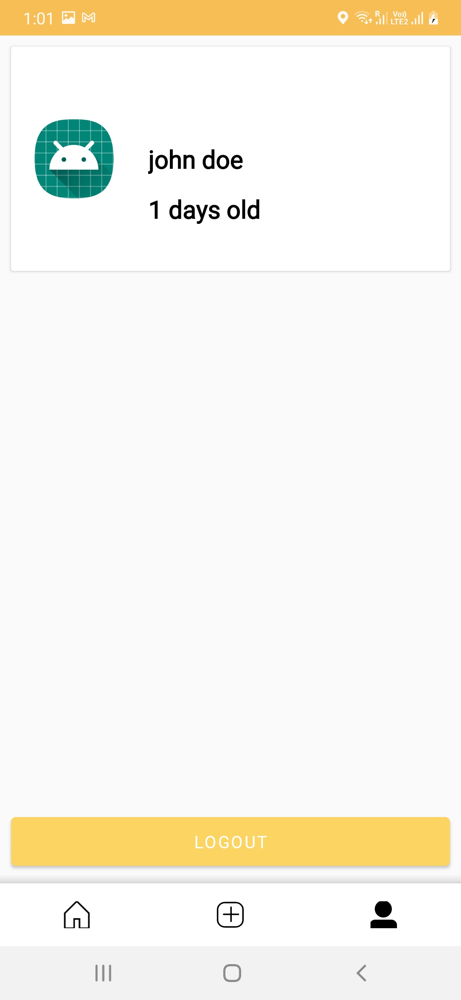

# carapp
Car application

This project is a simple example of MVVM pattern using ViewModel, Livedata, Retrofit, RxJava. 

The example uses Free API for fetching data.
This example contains different screens like -Login, Registration, Main Page that contains user location and car locations, Profile page for fetching profile data

Below is the architecture diagram(Image references::https://developer.android.com/jetpack/docs/guide)

Below are the screenshots of the image
1) Splash Page-

2) Login Page-

3) Registration Page-

4) Main Page showing locations of all vehicles, including custom image(custom marker) of the vehicle. Once user clicks on the vehicle, license plate number of the vehicle is shown-

5) Main page showing current location of the user. When 'Locate User' button is clicked, map will point to the current location of user and all the markers of the vehicles on the screen is removed-

6) Profile page. When user clicks on 'Logout' button, user is logged out of the application and redirected to the login page-

